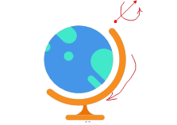

# 交互式图形学综合实验

## 实验介绍

本实验单元关注综合运用所学，搭建一个完整的实验场景，并可在此基础深入验证特定算法。

## 实验目的

- 完成多对象、多光源的场景生成与渲染。
- 以本实验平台为基础，验证相关算法。

 

## 实验任务

本单元实验等级为高级(Advanced)，仅描述任务内容或类型，选做任务同学们根据个人精力与兴趣选择一个方向展开实验与验证。

- 必选任务
  - bumpmapping，学生需要使用实验提供的地球素材，完成法线贴图。
    - 参考资料：[什么是法线贴图？](https://docs.unity3d.com/cn/2021.1/Manual/StandardShaderMaterialParameterNormalMap.html)
  - 模型设计，给地球增加弧形支架与底座，运用场景管理知识，组合地球仪，并且定义各部件相对运动的坐标计算方式。参照下图，增加组合的球体旋转与支架摆动方式。
    - 
  - 给场景增加纹理贴图的天空盒（球形、六面体），增加全局环境光，定义多个类型不同光源，验证地球仪组合运动情况下的贴图及光照渲染效果。
  - 给场景增加Percentage-Closer Soft Shadows效果（一种渲染柔和阴影的技术），并移动场景内的光源，观察阴影的变化情况，特别是阴影边界处的效果，以验证PCSS的效果。
    - 参考资料https://developer.download.nvidia.com/SDK/9.5/Samples/MEDIA/docPix/docs/PCSS.pdf

实验报告需呈现这四方面的实现方法与效果。

- 选作项目

1. 可尝试光线追踪、光线烘培等全局光照模型。
2. 可尝试SSAA, MSAA, TAA, FXAA, SMAA等多种抗锯齿渲染算法

3. 可尝试更多其他阴影技术，以对比不同技术之间的效果差异

4. 可尝试金属、玻璃、半透明等渲染

5. 可尝试BRDF等微表面漫反射模型
6. 可以尝试基于波动光学的渲染技术

 

该项不做硬性要求，给出课堂教学的图形学基础内容之外，可以进一步验证的领域方向。包括但不限于上述领域，感兴趣的同学可以自行查找资料与开源代码，进行验证。实验报告中独立章节体现，主要论述问题、方法原理、使用了什么开源项目，自己做了哪部分工作。

